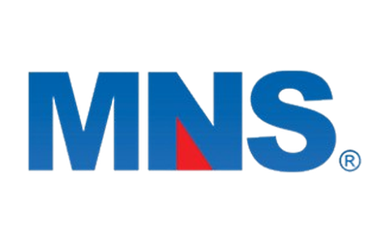
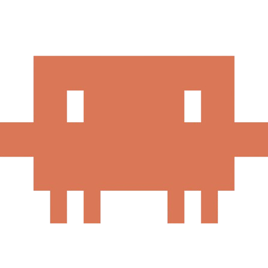
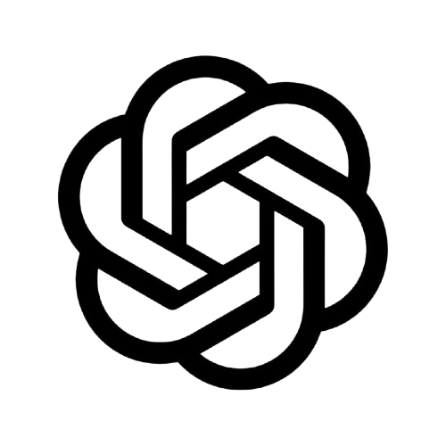

 

 

## About

Hardware specialist by trade, software engineering student by choice. My days are spent with the
physical layer — boards, components, diagnostics, and the kind of failures that never show up in a
stack trace. My nights are spent on the other side of the same problem, learning to build the
software that runs on top of it. Linux everywhere in between.

- Currently working as a **Hardware Specialist at MNS**
- Studying **Software Engineering at PUC-Campinas**
- Daily driver: **Debian / Linux**
- Comfortable across the **JetBrains** suite, **Android Studio**, and **VS Code**
- Big believer in low-level understanding — you cannot debug what you do not understand

 

## Experience

<table>
<tr>
<td width="140" align="center" valign="middle">
  
</td>
<td valign="middle">
  <h3>Hardware Specialist — MNS</h3>
  

    Diagnostics, maintenance, and technical support on hardware and equipment.
    Day-to-day work spans component-level troubleshooting, assembly and validation,
    and translating messy real-world symptoms into a root cause someone can actually fix.
  

  

    <code>Hardware</code> &nbsp;·&nbsp; <code>Diagnostics</code> &nbsp;·&nbsp;
    <code>Technical Support</code> &nbsp;·&nbsp; <code>Maintenance</code>
  

</td>
</tr>
</table>

 

## Education

<table>
<tr>
<td width="140" align="center" valign="middle">
  
</td>
<td valign="middle">
  <h3>Software Engineering — <a href="https://www.puc-campinas.edu.br/">PUC-Campinas</a></h3>
  

    Undergraduate degree in Software Engineering. Building the formal foundation —
    algorithms, data structures, architecture, and software process — on top of a
    background that started at the hardware level.
  

  

    <code>Algorithms</code> &nbsp;·&nbsp; <code>Data Structures</code> &nbsp;·&nbsp;
    <code>Software Architecture</code> &nbsp;·&nbsp; <code>Engineering Process</code>
  

</td>
</tr>
</table>

 

## Tech Stack

#### AI & Agents

<table align="center">
<tr>
<td align="center" width="110"> <b>Claude</b></td>
<td align="center" width="110"> <b>Claude Code</b></td>
<td align="center" width="110"> <b>ChatGPT</b></td>
<td align="center" width="110"> <b>Gemini</b></td>
<td align="center" width="110"> <b>Antigravity</b></td>
</tr>
</table>

#### Systems

#### Editors & IDEs

 

#### Workflow

 

## GitHub Stats

 

 

## Contribution Graph

<picture>
  <source media="(prefers-color-scheme: dark)" srcset="https://raw.githubusercontent.com/Tiez0/Tiez0/output/github-snake-dark.svg" />
  <source media="(prefers-color-scheme: light)" srcset="https://raw.githubusercontent.com/Tiez0/Tiez0/output/github-snake.svg" />
  
</picture>

 

## People I Look Up To

<table align="center">
<tr>
<td align="center" width="220">
   
  <b>Linus Torvalds</b> 
  Linux &amp; Git
</td>
<td align="center" width="220">
   
  <b>Hideo Kojima</b> 
  Game Design
</td>
<td align="center" width="220">
   
  <b>Terry A. Davis</b> 
  TempleOS
</td>
</tr>
<tr>
<td align="center" valign="top">Built the kernel that runs most of the world, then built the tool everyone versions code with. Proof that stubborn engineering taste scales.</td>
<td align="center" valign="top">Treats a medium as something to be argued with, not obeyed. A reminder that craft and vision beat playing it safe.</td>
<td align="center" valign="top">Wrote an entire operating system — kernel, compiler, graphics — alone. A singular, tragic, unmatched display of low-level mastery.</td>
</tr>
</table>

 

